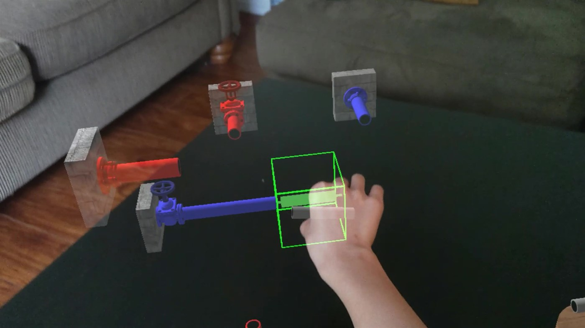
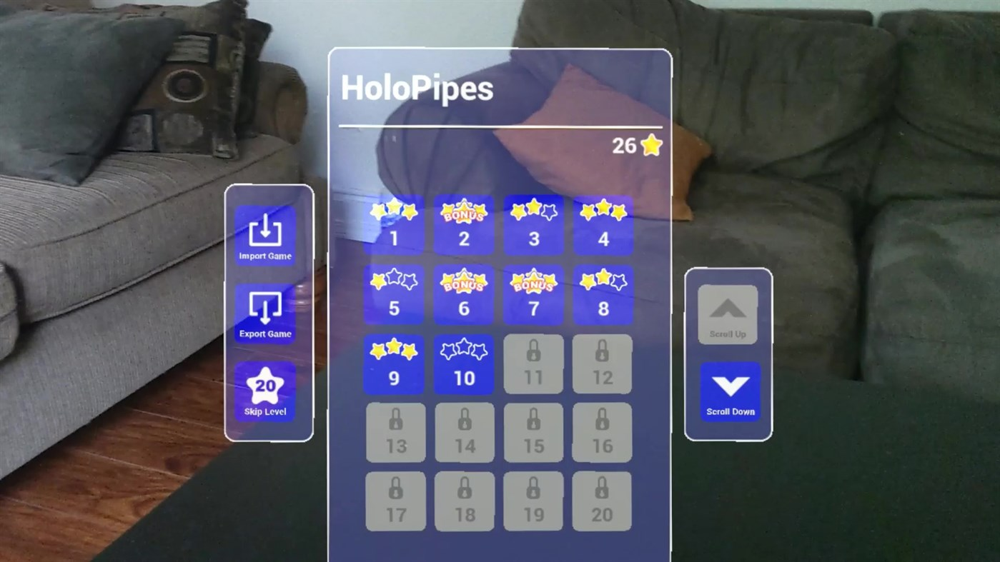

# HoloPipes

Supported Unreal versions | Supported device
:-----------------: | :----------------:
Unreal Engine 4.26+ | HoloLens 2

Play the classic pipes puzzle game, taken to another dimension! HoloPipes is an open source sample app for HoloLens 2, built with Unreal Engine. If you're just looking to try out the app, HoloPipes is also available for download to a HoloLens 2 device from the [Microsoft Store](https://www.microsoft.com/en-us/p/holopipes/9mszb3nnrxn9).

## Contents

| File/folder | Description |
|-------------|-------------|
| `docs` | README assets and documentation. |
| `pipes` | Unreal Engine project files and assets. |
| `scripts` | Build and artifact scripts. |
| `.gitignore` | Define what to ignore at commit time. |
| `CODE_OF_CONDUCT` | Microsoft Open Source Code of Conduct policy. |
| `LICENSE` | MIT source code license. |
| `README.md` | This README file. |
| `SECURITY` | Software security and issue reporting information. |

## Prerequisites

* Windows 10 1809 or later
* Windows 10 SDK 10.0.18362.0 or later
* [Unreal Engine](https://www.unrealengine.com/download) 4.26 or later
* Microsoft HoloLens 2 device [configured for development](https://docs.microsoft.com/windows/mixed-reality/develop/platform-capabilities-and-apis/using-visual-studio#enabling-developer-mode) or [Emulator](https://docs.microsoft.com/windows/mixed-reality/develop/platform-capabilities-and-apis/using-the-hololens-emulator#hololens-2-emulator-overview)
* [Visual Studio 2019 with the required workloads](https://docs.microsoft.com/windows/mixed-reality/develop/unreal/tutorials/unreal-uxt-ch1#installing-visual-studio-2019)

## Setup 

1. Clone or download this sample repository
2. Navigate to the **pipes** folder and open up **HoloPipes.uproject** in Unreal Engine 4.26 or later

## Running the app 

* To stream the experience from a PC to a HoloLens 2 headset, follow the instructions for [streaming in Unreal](https://docs.microsoft.com/en-us/windows/mixed-reality/unreal-streaming).

* To package and deploy the app to a HoloLens 2 headset, follow the instructions for [deploying to device in Unreal](https://docs.microsoft.com/en-us/windows/mixed-reality/unreal-deploying).

# Next steps

Visit the [Mixed Reality Unreal Samples repository](https://github.com/microsoft/MixedReality-Unreal-Samples) to see a list of all of Microsoft's open source mixed reality sample projects built with Unreal Engine.

# Contributing

This project welcomes contributions and suggestions.  Most contributions require you to agree to a
Contributor License Agreement (CLA) declaring that you have the right to, and actually do, grant us
the rights to use your contribution. For details, visit https://cla.opensource.microsoft.com.

When you submit a pull request, a CLA bot will automatically determine whether you need to provide
a CLA and decorate the PR appropriately (e.g., status check, comment). Simply follow the instructions
provided by the bot. You will only need to do this once across all repos using our CLA.

This project has adopted the [Microsoft Open Source Code of Conduct](https://opensource.microsoft.com/codeofconduct/).
For more information see the [Code of Conduct FAQ](https://opensource.microsoft.com/codeofconduct/faq/) or
contact [opencode@microsoft.com](mailto:opencode@microsoft.com) with any additional questions or comments.
